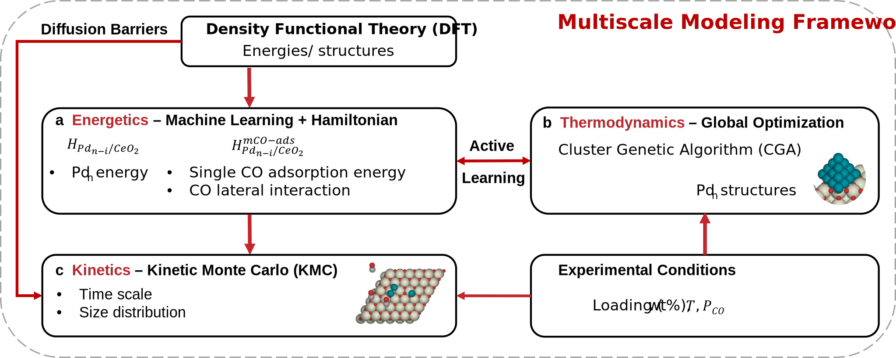

# Pdn-CO-Dynamics

Lattice Kinetic Monte Carlo (KMC) Simulations for Subnanometer Pdn clusters Dynamics under pressure of CO.

The simulations are run in the graph-theoretical KMC software [Zacros](https://zacros.org/). 
The inputs and outputs are processed using the Python package [Zacros-Wrapper](https://github.com/VlachosGroup/Zacros-Wrapper/tree/master).

This repository contains sample input files, processed output files, and structure visualizations.

## Computational Framework 

## Simulation Setup
| Configuration Types | Number of Pd Atoms | Temperatures  | Pressures           |
| ------------------- | ------------------- | ------------- | ---------------     |
| Single Pd           | 8                   | 300K, 700K    | 0, 0.1 bar, 1 mbar  |
|                     | 20                  | 300K          | 0, 0.1 bar, 1 mbar  |
|                     |                     | 700K          | 0, 0.1 bar          |
|                     | 32                  | 300K          | 0, 0.1 bar, 1 mbar  |
|                     |                     | 700K          | 0 bar               |
| Pd4_3d clusters     | x2                  | 300K, 700K    | 0, 0.1 bar, 1 mbar  |
|                     | x6                  | 300K, 700K    | 0, 0.1 bar, 1 mbar  |
|                     | x10                 | 300K          | 0, 0.1 bar, 1 mbar  |
|                     |                     | 700K          | 0 bar               |

## Sample Simulation Inputs
Input files for Zacros simulations
- [Sample_Inputs](/Sample_Inputs)

## Simulation Result Graphics
Graphics produced from outputs of Zacros simulations
- [Simulation_Result_Graphics](/Simulation_Result_Graphics)
